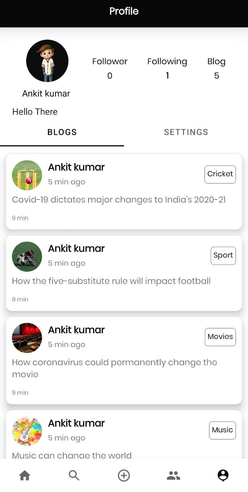
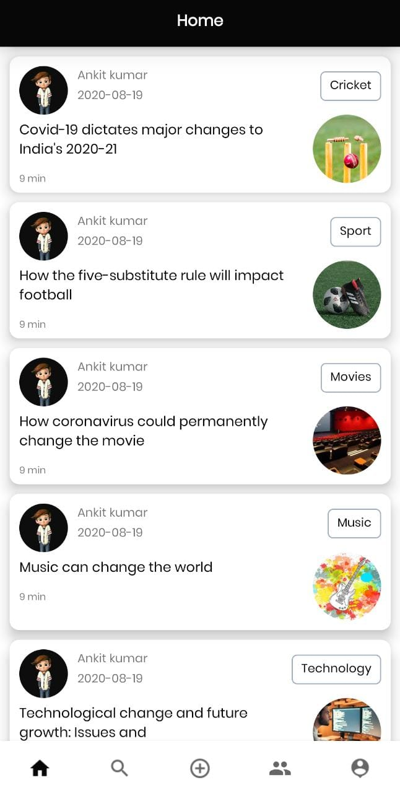
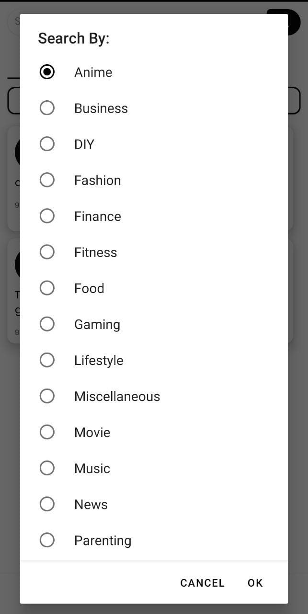
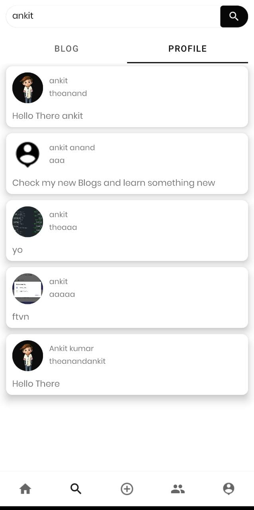
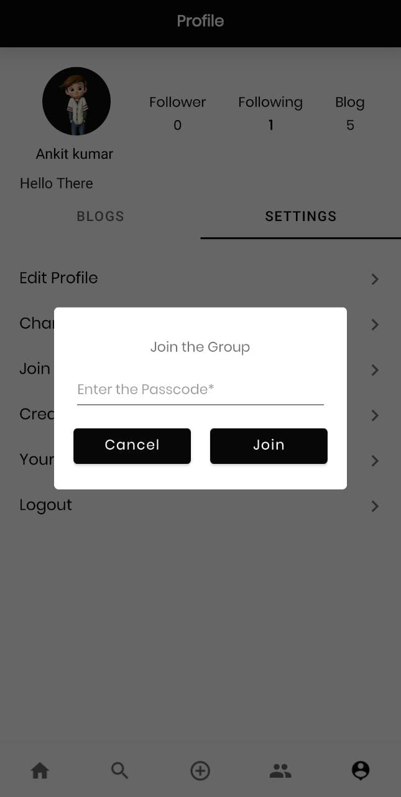
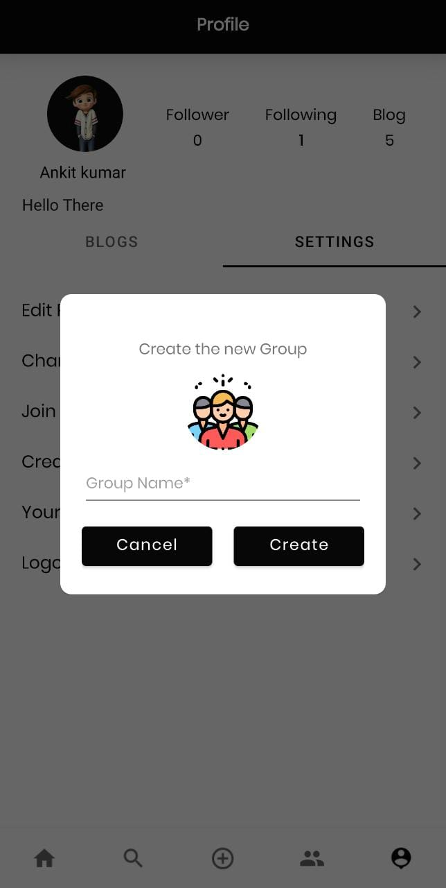

## Blogic Android App

We surfaced through the features of popular blogging apps like Medium, social networking apps like Instagram and E-learning apps like Google classroom and came up with Blogic.

## Screenshots

<table>
 <tr>
    <td></td>
    <td></td>
    <td></td>
  </tr>
   <tr>
    <td></td>
    <td></td>
    <td></td>
  </tr>
</table>

